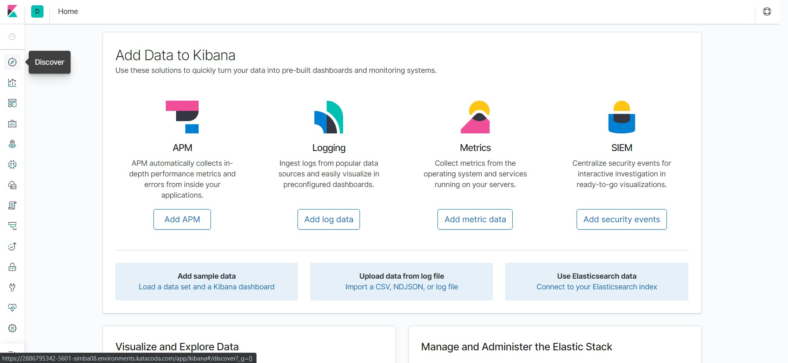
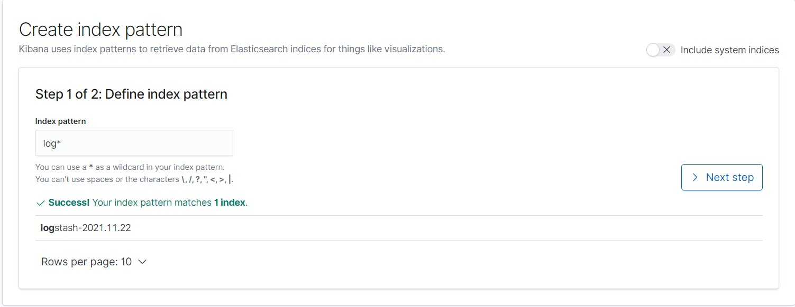
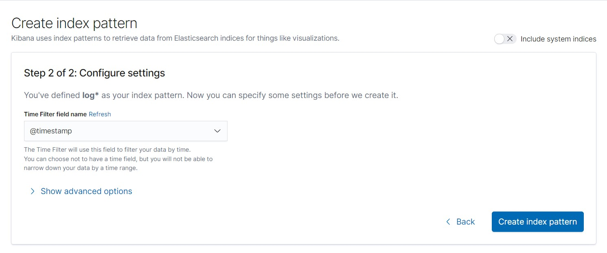
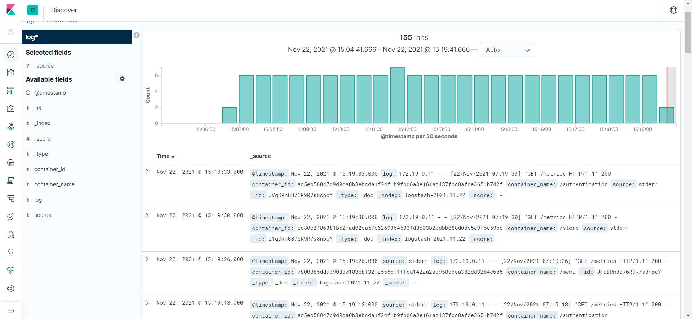

## Opening Kibana

To collect the logs, we have also configured the EFK (Elasticsearch, Fluentbit, Kibana) stack.

As the containers are configured and running, we can look at the metrics.
If you are running on your localhost, open:
`localhost:5601`

If you are using Katakoda, open:
https://[[HOST_SUBDOMAIN]]-5601-[[KATACODA_HOST]].environments.katacoda.com

Follow the steps to have a look at the logs:
#### Step 1
When you reach at home, navigate to dicover option:

#### Step 2
Under Discover, create an index pattern of `log*`

#### Step 3
Set configure settings to `@timestamp` and select `Create index`

#### Step 4
Once the index is create, click on the discover option from the left menu again.
You can see the logs of different endpoints connected with the EFK stack as follows:
