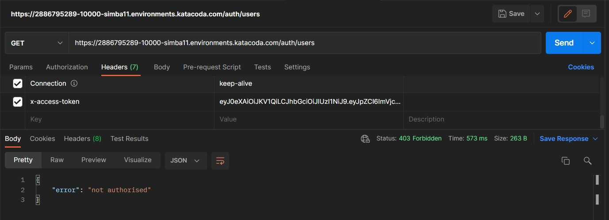
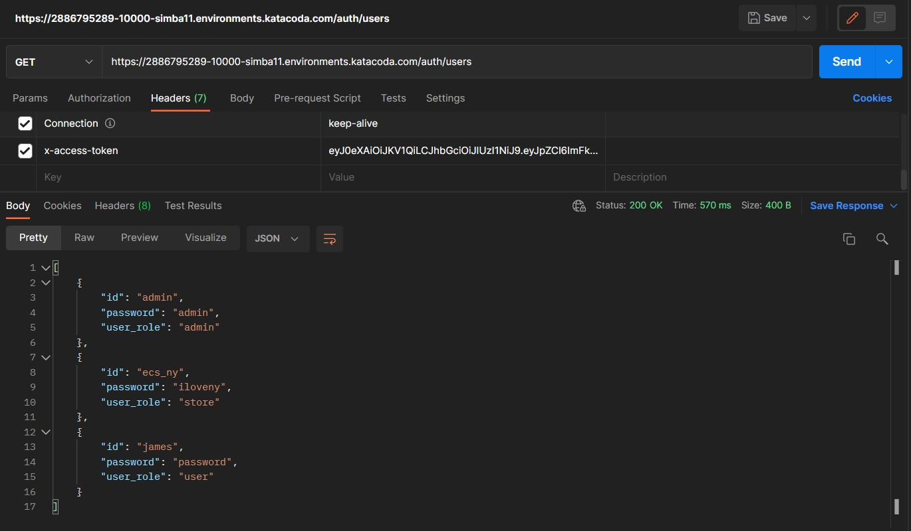

## Checking the token

The authentication service has a path */auth/users* which lists the details of every user in the database.
Now, we do not want anyone to get it, we only want the admin to access this information.
*Due to the character limitation on Katakoda terminal, we cannot use the terminal to test the token's validity*

So, to test the token, use POSTMAN with following link (if you are using katakoda):
https://[[HOST_SUBDOMAIN]]-10000-[[KATACODA_HOST]].environments.katacoda.com/auth/users

Under header tab of request in Postman, define, **x-access-token:** *<YOUR_TOKEN>*

It should give the following result:

As expected, you cannot view the information of other users if you are not admin.

Now let us repeat the previous step for admin:
`
    curl -X POST -H "Content-Type: application/json" \
    -d '{"id": "admin", "password": "admin"}' \
    http://localhost:10000/auth/signin
`{{execute}}

Now if we repeat this step with the token of admin, it should work.

As expected it is working.

Similarly we can test it for ***/stores/set_status/<store_id>***
